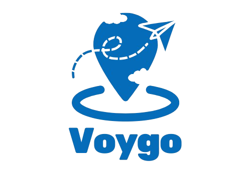

# ✈️ Voygo - Your Personal AI Travel Planner



**Voygo** is an intelligent, full-stack travel planning application that leverages Artificial Intelligence to craft highly personalized itineraries. Simply input your destination, budget, travel companions, and trip duration, and Voygo will generate a complete day-by-day plan—complete with hotel recommendations, exact places to visit, times to spend, and automatic photo integration.

## ✨ Key Features

- **🤖 AI-Powered Itineraries:** Generates tailored travel plans in seconds using state-of-the-art generative AI representations.
- **🗺️ Smart Location Search:** Integrated tightly with the **Google Places API** for seamless, accurate destination selection.
- **📸 Rich Experience Visuals:** Automatically pulls authentic location photography via the **Google Places Photo API**.
- **🔒 Secure Authentication:** Painless 1-click Google Sign-In powered by `@react-oauth/google`.
- **☁️ Cloud Trip Dashboard:** Saved trips are persisted instantly to **Firebase Firestore** so you can view your past itineraries at any time in `/my-trips`.
- **📱 Fully Responsive:** Clean and modern user interface built using **TailwindCSS** and **shadcn/ui** components.

## 🛠️ Tech Stack

- **Frontend:** React 19 (Vite), TailwindCSS, shadcn/ui
- **Routing:** React Router DOM
- **Backend Service & DB:** Firebase (Firestore)
- **External APIs:** Google Places Developer APIs, AI Model Web Services
- **Deployment Ready:** Configured for Vercel out-of-the-box

## 🚀 Getting Started

### Prerequisites
Make sure you have Node installed, as well as active API credentials for:
- Google Maps / Places API (Enabled billing)
- Google OAuth Client ID
- Firebase Project setup
- Generative AI API

### Local Setup

1. **Clone the repository:**
   ```bash
   git clone https://github.com/widushan/AI-Trip-Planner.git
   cd AI-Trip-Planner/ai-travel-planner
   ```

2. **Install dependencies:**
   ```bash
   npm install --legacy-peer-deps
   ```

3. **Set up Environment Variables:**
   Create a `.env.local` file in the root of the `ai-travel-planner` directory and supply your API keys:
   ```env
   VITE_GOOGLE_PLACES_API_KEY=your_google_maps_api_key
   VITE_GOOGLE_AUTH_CLIENT_ID=your_google_oauth_client_id
   # Add your specific AI Provider keys or Firebase config tokens as well
   ```

4. **Run the Development Server:**
   ```bash
   npm run dev
   ```
   Open [http://localhost:5173](http://localhost:5173) in your browser to view the application.


## 🚢 Deployment

The repository includes a `.npmrc` file (to handle React 19 peer-dependency resolution smoothly during build) and a `vercel.json` providing fallbacks for React Router SPA behavior. 

Simply connect the `ai-travel-planner` subdirectory to **Vercel**, plug in your identical environment variables, and hit Deploy!


Deploy in Vercel -->
https://ai-travel-planner-nine-nu.vercel.app/


## 📜 License

Copyright © 2026 Voygo. Designed by C.A Pasindu K.W. All rights reserved.
